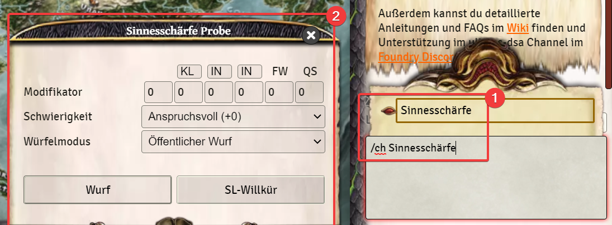
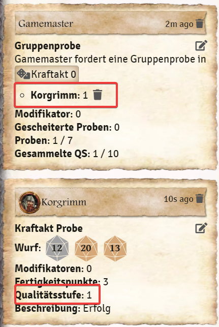
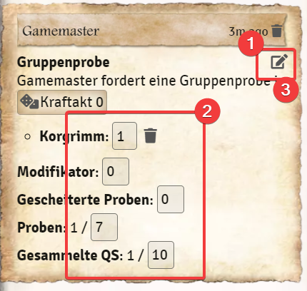

# Chatbefehle
Es gibt ein paar DSA spezifische Chatbefehle die ihr im Spiel nutzen könnt. Diese werden euch auch erklärt wenn ihr `/help` in den Chat eingebt:
* Bezahlen - `/pay`
* Auszahlen - `/getPaid`
* Fähigkeits-Schnellzugriff - `/sk`, `/sp`, `/li`, `/at` und `/pa`
* Zustände - `/conditions`
* Tabellen - `/tables`
* Wurf anfordern - `/rq`
* 3w20 Probe - `/ch` [siehe unten](de-chatbefehle#ch-3w20-probe)
* Gruppenprobe - `/gc` [siehe unten](de-chatbefehle#gc-gruppenprobe)
* Ausrüstungspakete - `/packages` [siehe unten](de-chatbefehle#packages-ausrüstungspakete)  
* Anwendungsgebiete - `/apps` [siehe unten](de-chatbefehle#anwendungsgebiete)
  
In dieser Anleitung findet ihr die Befehle, bei denen die genaue Beschreibung des Befehls im Chatfenster zu umfangreich ist.

## `/ch` 3w20 Probe
Ihr könnt für NSCs die oder eine spontane Probe, auch eine 3w20 Probe mit Fertigkeitswerk direkt über den Chat auslösen.
1. Gebt in den Chat `/ch`ein und könnt mit dem Anfangsbuchstaben (oder weiteren) und der Verwendung der Tab-Taste eins der Talente auswählen und mit Enter den Befehl abschicken.   
2. Es öffnet sich ein Fenster bei dem ihr den Wurf modifizieren können.  
  
    

### Probenfenster 3d20 Probe
Der Wurf wird ohne weitere Einstellungen auf die Eigenschaften 12/12/12 ohne Fertigkeitspunkte ausgeführt. Ihr könnt im Probenfenster die Probe, Eigenschaften, Fertigkeitspunkte und QS Modifizieren. Wie bei der Probe aus dem Charakterbogen, kann die Probe auch über die Schwierigkeit modifiziert werden. Als letztes lässt sich noch der Art des Wurfes beeinflussen.  
  
#### Beispiel:
Ich würfel ein Probe erleichtert um 1 (1), auf die Eigenschaften 14/10/14 (2) mit 4 Fertigkeitspunkten (3):  
  
  

## `/gc` Gruppenprobe
Bei der Gruppenprobe, kann jeder Spieler eine Probe ablegen. Die QS aller Teilnehmer wird dann zu einer Gesamt QS summiert.
1. in den Chat den Befehl `/gc` ein und setzt ein Leerzeichen. 
2. Daraufhin erscheint eine Liste aller Fertigkeiten die ihr verwenden könnt. Wählt eine davon aus oder gebt sie direkt ein und schickt den Befehl mit Enter ab.  
  
  ![Gruppenprobe]  
  
Daraufhin erscheint im Chat eine Meldung bei der jeder Spieler der an der Probe teilnehmen möchte, auf die Fertigkeitsprobe klicken und damit an der Gruppenprobe teilnehmen kann.  
  
    

  
Außerdem könnt ihr die Probe nach belieben verändern:  
1. Klickt auf den Stift neben der Probe.  
2. Verändert die gewünschten Werte.  
3. Speichert mit dem Stift die Änderungen ab.  
  
  

## `/packages` Ausrüstungspakete
Über diesen Befehl können Spieler  eines der drei Ausrüstungspaketen aus dem Grundregelwerk für ihren Charakter kaufen. Dies funktioniert nur als Spieler. Als Spielleiter müsst ihr auch dann separat als Spieler anmelden (**Tipp:** Hierfür könnt ihr euch auch einfach einen eigenen Spieler anlegen).
Gebt den Befehl `/packages`in den Chat ein und schickt ihn mit Enter ab.
1. In der Liste bezahlt ihr über einen Klick auf den Betrag des Paktes
2. Im Chat wird dann angezeigt welches Paket ihr gekauft habt.
3. Über den Namen des Paketes könnt ihr dies dann per Drag and Drop in euren Charakter ziehen.
4. Über das "I" könnt ihr euch noch den Inhalt des Paketes in den Chat ausgeben lassen(5) 
5. Die einzelnen Items können dann auch per Drag and Drop in den Charakterbogen gezogen werden. 
  
    
  
## Anwendungsgebiete
**Achtung!**: Die Verwendung der Anwendungsgebiete kann Performanceprobleme in der Welt verursachen. Wenn überhaupt sollten höchstens die Spielercharaktere damit ausgestattet werden.  
Über der Befehl /apps erscheint im Chat ein Fenster mit dem alle Anwendungsgebiete auf einmal zu einem Akteuer hinzugefügt werden können. Dafür muss einfach der "Begriff" Anwendungsgebiete aus diesem Chatfenster in den Charakterbogen gezogen werden. 
  
  
  
*[x]Zuletzt bearbeitet: 04.11.2021*  
*Neu: Anwendungsgebiete*  
*Überarbeitet: Bilder und Text*
