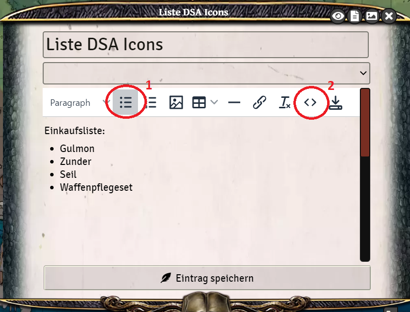
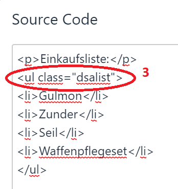
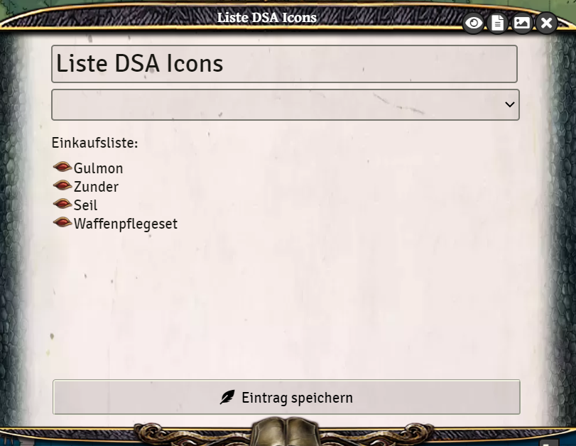

# Journal - Liste mit DSA Icons (Auge)

Um in einem Journal Eintrag für eine Liste die DSA Augen zu verwenden, muss man den HTML Code ein wenig bearbeiten.
1. Erstmal schreibt man die Liste mit der normalen Listenfunktion des Journal Editors
2. Dann wird der HTML Code über das <> Symbol geöffnet

3. Dort gibt es den Eintrag `<ul>`. Dieser muss geändert werden zu `<ul class="dsalist">`

4. Dann werden nach dem Speichern des Eintrags die Punkte durch die typischen DSA Augen ersetzt. (Im Bearbeitungsmodus sehe sie immer noch wie normale Punkte aus!)

*[x]Zuletzt bearbeitet: 04.11.2021*  
*Inhalt kontrolliert, keine Änderung notwendig*
