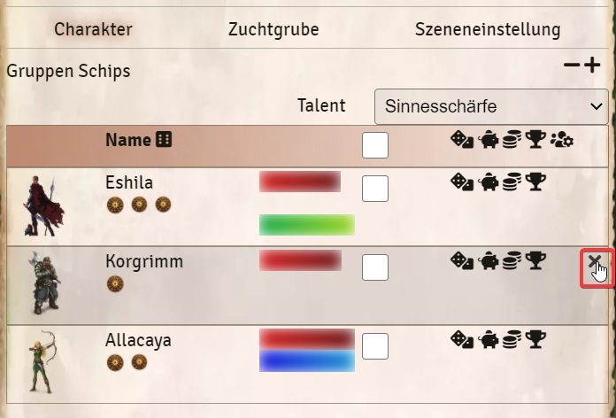

# Meister Menü
Das Meister Menü bietet Funktionen für den Spielleiter. Es werden alle Akteuere vom Typ Spieler angezeigt, die mindestens einem Spieler mit den Rechten *Besitzer* zugeordnet wurden. Danach können diese aber beliebig verschoben oder sogar aus dem Menü entfernt werden.

Ich findet es auf der linken Seite unter *Meister Menü* -> *Meister Menü*

## Funktionen:  
 
1. **Talent:** Auswahl des Talentes die bei einem oder allen markierten Charakteren, sowie der Gruppenprobe genutzt werden soll. 
2. **Zufälliges Opfer:** Würfelt einen der Charaktere zufällig aus (Rechtsklick berücksichtigt Nachteil Pechmagnet)  
3. **Bild des Charakters**
4. **Name und Schicksalspunkte:** mit einem Rechts/Linksklick könnt ihr den Schicksalspunktestand der Spieler verändern.  
5. **Lebens-, Astral- und Karmalpunkte**  
6. **Checkbox:** dient zum markieren des Charakters um ihn bei den Aktionen für alle zu berücksichtigen    
**Die folgenden Funktionen können entweder für alle Charaktere ausgeführt werden (Buttons Kopfzeile) oder aber für einzelne Charaktere (Buttons in der Zeile des Charakters)**
7. **Probe:** Würfelt verdeckt auf das gewählte Talent (1).  
8. **Bezahlung erhalten:** Erzeugt ein Chatfenster, über dass der eingegebene Betrag (In Siltertalern) vom Spieler zu seinem Charakter hinzugefügt werden kann.  
9. **Ausnehmen:** Erzeugt ein Chatfenster über dass der eingegebene Betrag (In Silbertalern) von den Spielern bezahlt werden kann.  
10. **Mit Abenteuerpunkten belohnen:** Fügt dem Charakter die eingegebene Anzahl an Abenteuerpunkten hinzu.  
11. **Gruppenprobe:** Löst eine Gruppenprobe auf Basis des ausgewählten Talents (1) aus.  
12. **Details:** Die Details öffnet ihr mit einem Klick in die Zeile des Charakters. Dort befinden sich der Geldbeutel, der Erfahrungsgrad, die Vorteile und Nachteile des Charakters.
13. **Gruppenschips**: Können vom SL über +- für die ganze Gruppe vergeben werden. Diese lassen sich dann im Chat über das Kontextmenü verwenden.
14. **Zuchtgrube**: Wird auf dieser Seite näher beschrieben: [Meister-Menü-Zuchtgrube](de-meister-menue-zuchtgrube) 
15. **Szeneneinstellungen**: Wird auf dieser Seite näher beschrieben: [Meister-Menü-Szeneneinstellungen](de-meister-menue-szeneneinstellungen)  

## Charaktere entfernen/hinzufügen
Um einen Charakter aus dem Menü zu entfernen klickt ihr auf das X am hinter dem Char:  
  
  
  
Wollt ihr einen Char oder NSC hinzufügen, könnt ihr ihn einfach per Drag and Drop dort hineinziehen. Auch die Reihenfolge könnt ihr per Drag and Drop verändern.

*[x]Zuletzt bearbeitet: 04.11.2021*
