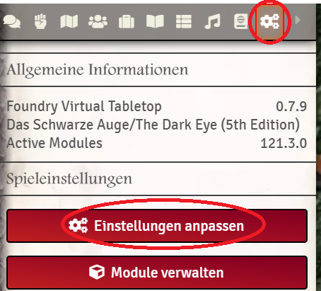
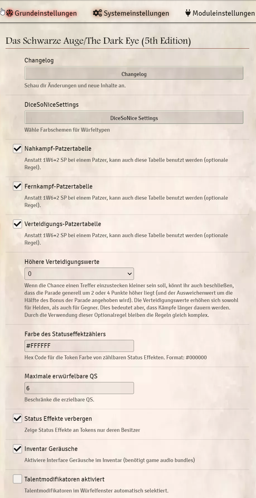
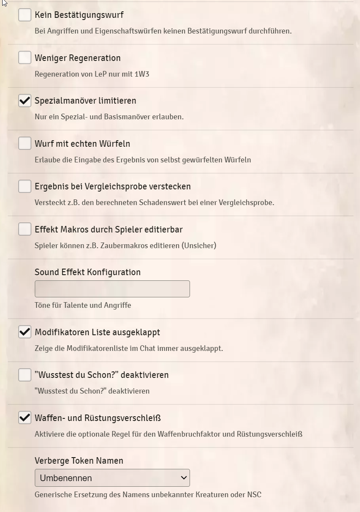

# Systemeinstellungen
Die Systemeinstellungen findet ihr im Menü unter Einstellungen anpassen und dann der Reiter Systemeinstellungen:  
 
   
 
 ## Systemeinstellungen (Beschreibung immer für Haken ist gesetzt):  
* **Changelog:** Das aktuelle Changelog.
* **DiceSoNiceSettings:** Einstellungen für Dice so Nice Würfel in Verbindung mit dem DSA System.
* **Nahkampf-Patzertabelle** 
* **Fernkampf-Patzertabelle**
* **Verteidigungs-Patzertabelle** 
* **Höhere Verteidigungswerte**
* **Farbe des Statuseffektzählers**
* **Maximal erwürfelbare QS**
* **Status Effekte verbergen:** Verbirgt die Status Effekte für Spieler von allen Tokens, für die sie keine Rechte haben.
* **Inventar Geräusche:** Sind die Game Audio Bundle Module aktiv, spielt Foundry einen Sound beim Ausrüsten und Handeln von Gegenständen ab.  
* **Talentmodifikatoren aktiviert:** Im Würfelfenster sind die Modifikatoren für Talente immer automatisch aktiv und müssen manuell deaktiviert werden.
* **Kein Bestätigungswurf** 
* **Weniger Regeneration**
* **Spezialmanöver limitieren:**
* **Wurf mit echten Würfeln:** Wird hier der Haken gesetzt, erscheint bei einer Probe ein Eingabefenster in dem ihr eure Würfelergebnisse eintragen könnt. Einstellung gilt für alle!
* **Ergebnis bei Vergleichsprobe verstecken:** Normalerweise wird nach einer Reaktion für alle im Chat die Schadensberechnung angezeigt. Wollt ihr nicht, dass die Spieler die Werte der Gegner sehen, könnt ihr dies hier deaktivieren.
* **Effekt Makros durch Spieler editierbar**
* **Modifikatoren Liste ausgeklappt**
* **"Wusstest du schon? deaktivieren**
* **Waffen- und Rüstungsverschleiß**
* **Verberge Token Namen:** Hier könnt ihr zwischen "Nein", "Ja" (Token immer unbekannt) und Umbenennen (Beim Ziehen auf Szene umbenennen) wählen.

 ## Screenshots der Einstellungen:
  
 

  *[x]Zuletzt bearbeitet: 04.11.2021*  
*Überarbeitet: an die aktuellen Systemeinstellungen angepasst*
