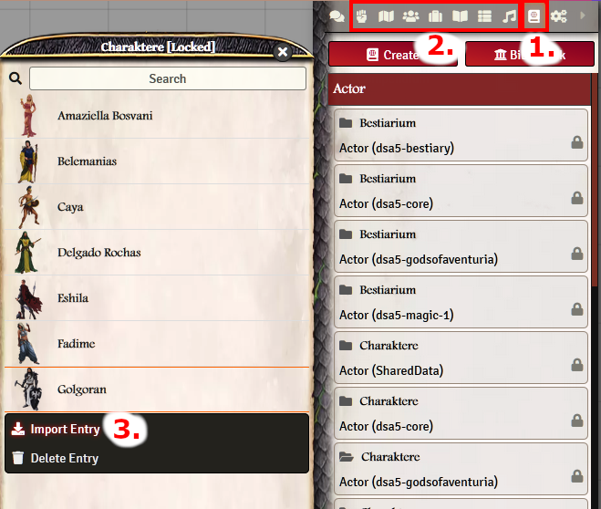
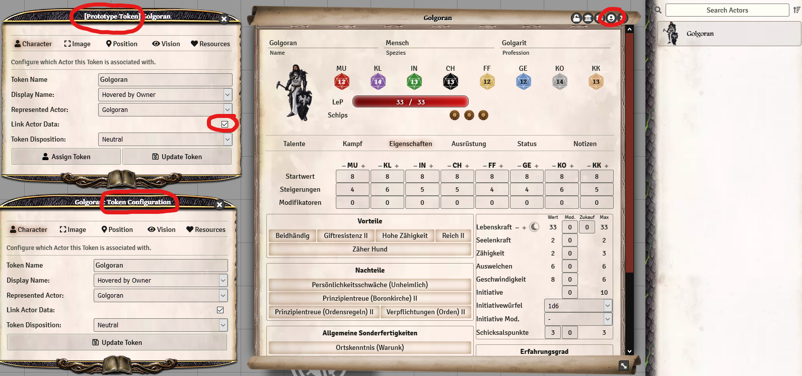

# Folgendes sollten jedem Spielleiter bekannt sein, der Foundry mit den DSA Modulen bedient

## DSA spezifisch
 - **Sprache**  
   - Die Module sind sprachabhängig. Entscheidet euch **vor dem Initialisieren,** welche Sprache ihr nutzen wollt (beim Erstellen der Welt in Foundry). Stellt die Sprache danach nicht mehr um.
   - Einträge lassen sich nur zwischen Welten importieren/exportieren, welche die gleiche Sprache verwenden.  

## Foundry spezifisch
 - **Kompendium vs. Verzeichnis vs. Charaktersheet**  
   - **Kompendium (1)** 
     - Ein Kompendium ist ein Container, der eine Vielzahl von Einträgen enthalten kann. Die Einträge werden durch den Ersteller der Kompendiums vorgegeben und sollten durch den Benutzer nicht verändert werden.
       - Kompendien können geöffnet und individuelle Einträge über Rechtsklick in die Foundry Verzeichnisse importiert werden (3). Alternativ kann ein komplettes Kompendium importiert werden, durch Rechtsklick auf den Hauptordner (anstatt auf einen Eintrag darin).
       - *Diese Daten liegen auf dem Server, werden jedoch nicht aktiv von Foundry geladen - und verbrauchen somit keine Ressourcen.*  
    - **Verzeichnisse (2)**
        - In den Verzeichnissen sind die aktiven Einträge zu finden, sortiert nach Kategorie (Szenen, Charaktere, Items, Journal Entries, Rollable Tables, Playlists).
        - Durch den Import aus einem Kompendium entsteht eine **unabhängige Kopie**. Nach Updates müssen die Einträge ggf. erneut importiert und ersetzt werden, oder manuell nachgetragen werden.
    - **Charaktersheet**
      - Einträge in einem Charaktersheet sind wiederum **unabhängige Kopien**. Wenn man zB einen Vorteil aus dem Verzeichnis in einen Charakter zieht, kann der Vorteil danach im Charaktersheet verändert werden. Der Eintrag im Verzeichnis (und Kompendium) ist von dieser Änderung nicht betroffen.

 - **Charaktere & Token**
   - Ein Charakter ("actor") ist jeglicher Eintrag im Verzeichnis "Actors Directory" in Foundry. Dazu gehören Spieler-Charaktere genauso wie NPCs, Tiere - alles, was ein Charaktersheet verwendet.
   - Wird ein Charakter auf eine Szene gezogen, wird ein Token generiert, basierend auf den Einstellungen im Prototype-Token (siehe nachfolgend).
     - Ein Token kann mit dem Einträg (im "Actors Directory") verknüpft sein, oder unverknüpft, via "Link Actor Data".
       - Verknüpfte Token "teilen sich" das Charaktersheet mit dem Eintrag im Actors Directory. Änderungen werden sofort übertragen. Legt man dem Charaktereintrag zb. eine Rüstung an, so haben sofort alle verlinkten Token den gleichen Zustand.
       - Unverknüpfte Token sind eine Kopie des Eintrags im Actors Directory. Egal, was man mit ihnen anstellt, die Änderungen passieren nur an dem Token, der Charakter selbst bleibt unberührt davon.  
     - Ein Token kann konfiguriert werden, so dass er zb. den Namen und die LeP des Charakters anzeigt, ob er verlinkt ist usw.
    Dabei ist es wichtig, den Unterschied zwischen einem Token auf der Szene (=Token Configuration) und einem Prototyp Token (=Grundeinstellung zu dem Token im Charaktersheet selbst) zu kennen.
       - Durch Doppelklick auf einen Token, öffnet sich das Charaktersheet (des TOKENS, nicht des Charakters). Durch Klick auf den Button für die Token-Settings (rechts oben im Charsheet) öffnen sich die Einstellungen für diesen einen Token. Änderungen betreffen nur diesen einen Token der angeklickt wurde.
       - Durch Klick auf den Charakter im Verzeichnis, öffnet sich das Charaktersheet (des Charakters, nicht eines Token). Durch Klick auf den Button für die Token-Settings (rechts oben im Charsheet) öffnen sich die Einstellungen für den PROTOTYPE Token. Dieser Prototyp wird verwendet, um einen Token zu generieren, wenn man den Charakter auf eine Szene zieht.
       - Weitere Informationen dazu, direkt auf der [Foundry Website](https://foundryvtt.com/article/tokens/)

