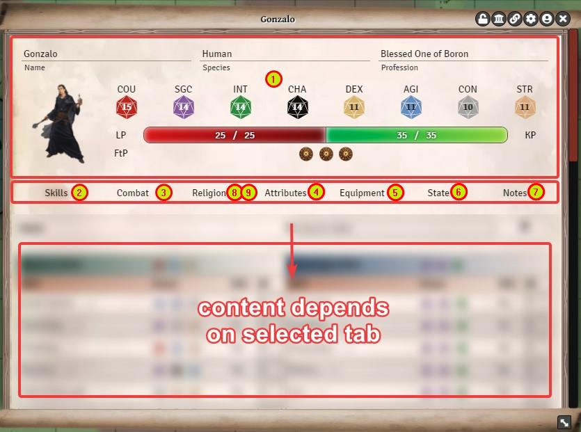
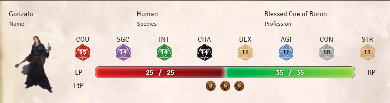
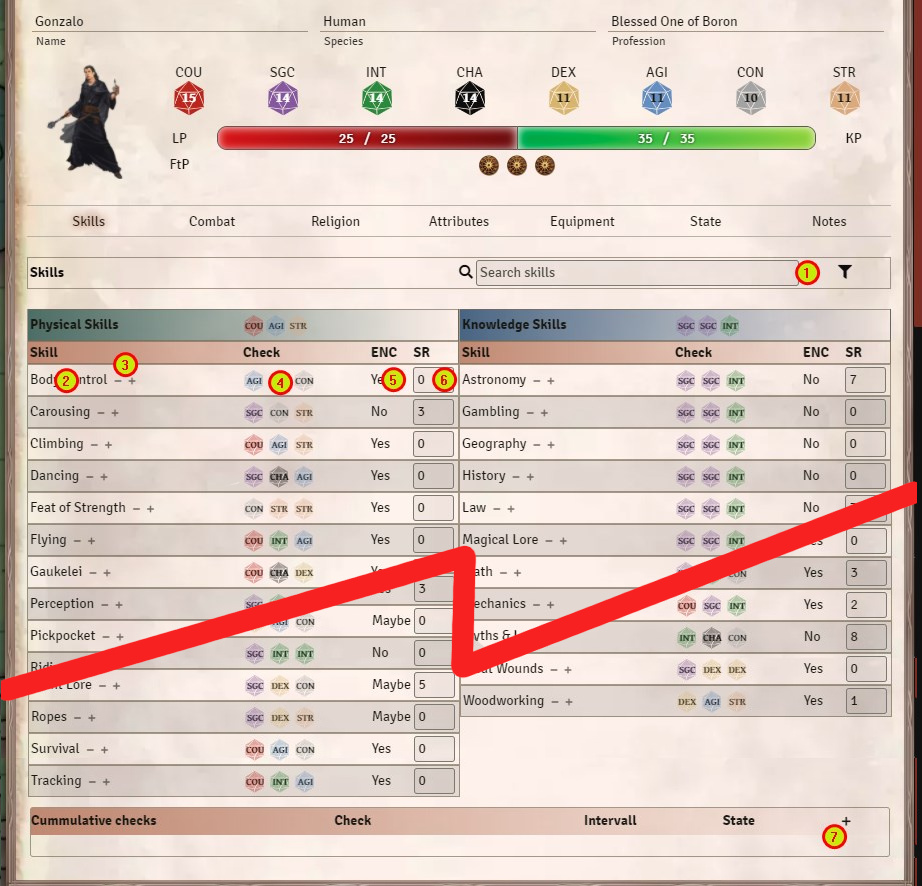
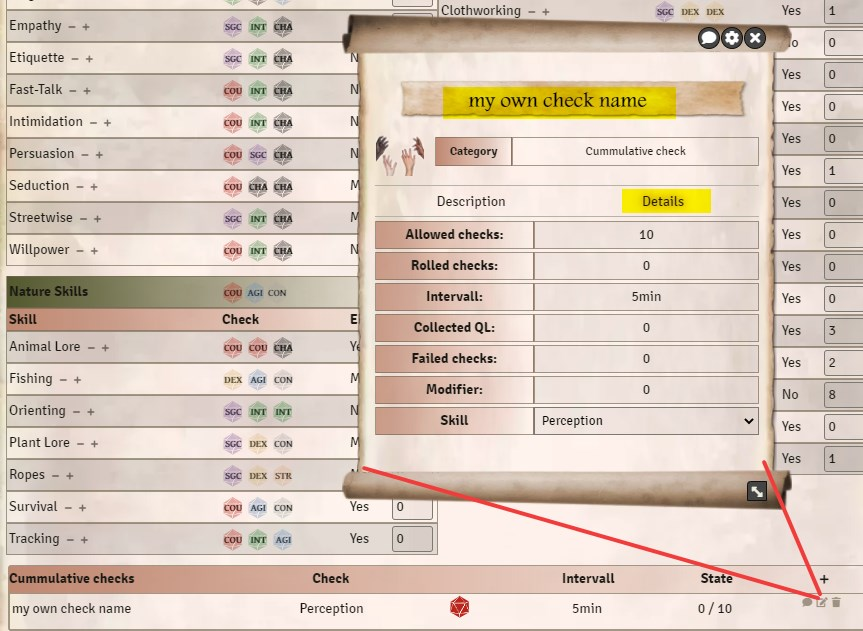
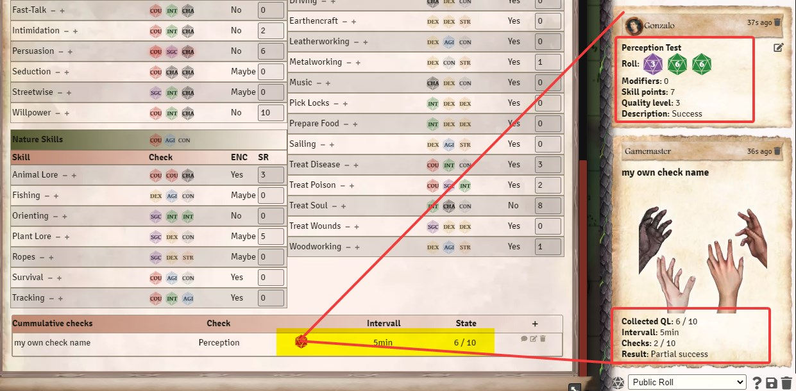
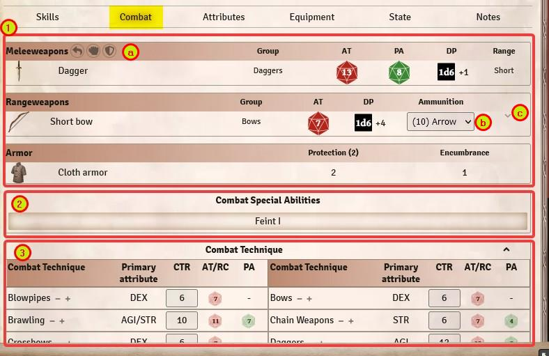
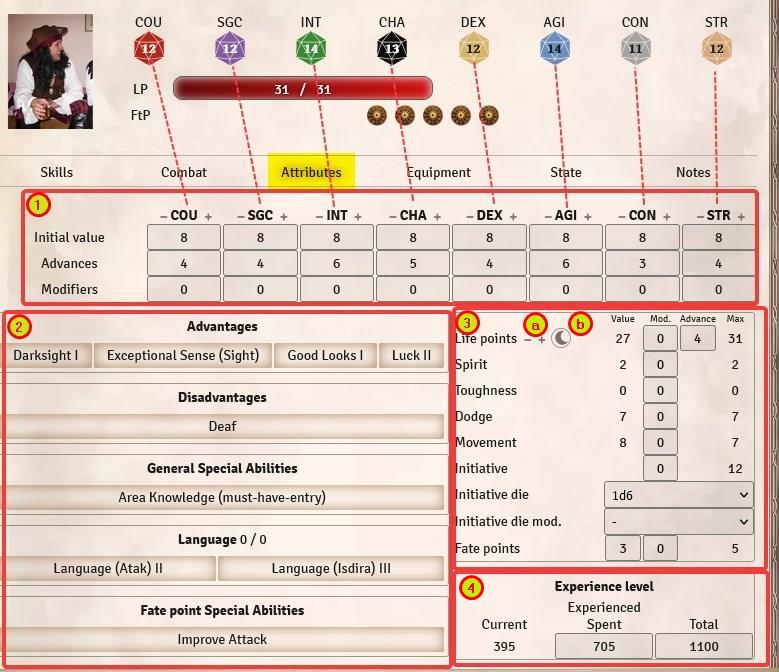
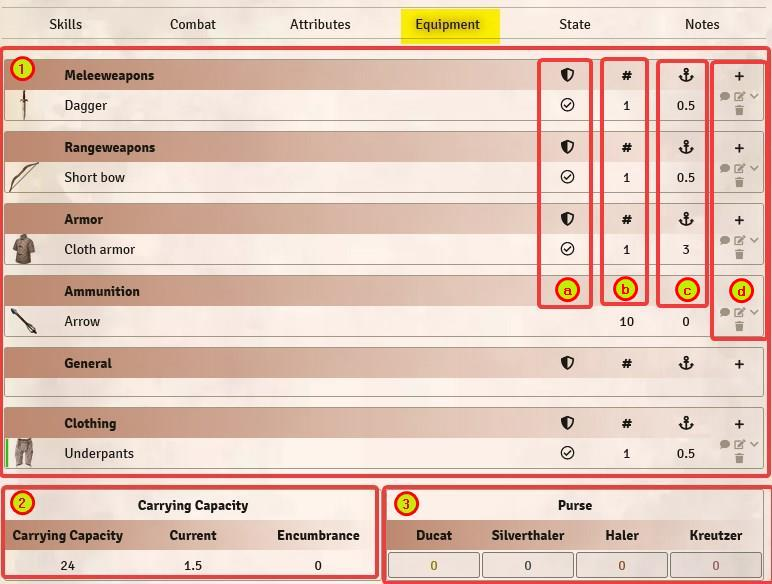

# Character Sheet - Structure
The structure of the character sheet is as similar as the sheet of the rulebook.
There are the categories in it:  
1. [Header](#1-header)  
2. [Skills](#2-skills)  
3. [Combat](#3-combat)  
4. [Attributes](#4-attributes)  
5. [Equipment](#5-equipment)  
6. [State](#6-state)  
7. [Notes](#7-notes)  
8. [Magic](#8-magic)  
9. [Religion](#9-religion)  
  
**Note**: The *magic* and *religion* tabs only appear if the character has at least one magical or karmal special skill/spell/ritual/liturgy/ceremony assigned. Also, only then do AE (astral energy) or KP (karma points) appear in the character sheet.
  
  

## 1. Header
This part of the sheet is always visible and shows a characters base information. Many values are calculated and derived from the settings in the [Attributes tab](#4-attributes).  
  

- **Name & picture:** Can be edited. When you change the name, make sure to update that information in the token settings as well
- **Species:** FYI only, can't be changed
- **Profession:** Can be edited. It's text only. See [here](en-character-creation#6-choose-profession) for more information on choosing / entering professions.
- **Attribute values:** derived from the [Attributes tab](#4-attributes), where it can be changed
- **Life/Astral/Karmal points** (current and max): can be edited. You have to enter the new number, not the changes (fe: you have 30 LP and you lose 5 LP, enter 25 LP). You CAN enter the changes on the token (fe: you have 30 LP and you lose 5 LP, enter -5, hit Enter and char has 25 LP as a result)
- **Fate Points:** Base value plus dis-/advantages. Maximum can't be changed, but you can add/spend FtP by clicking on them. (When you spend FtP via chatlog by right clicking a roll, the FtP is deducted/spent automatically)

## 2. Skills
This tab shows you all available skills, their skill rating and several options to use them in Foundry.  

  

1. **Search/Filter** When you activate the filter (right side symbol), you see all your skills with a SR higher than zero. To search for a skill, you can enter text into the search filed on the left side.  
2. **Description/Information** Klick on a skill to open a pop-up window with detailed description. You can send that to the chat (chat bubble symbol in the top right corner). Make sure you don't change anything, except you know what you are doing.
3. **+/- Buttons** To change your SR (= "level your skills") with correct AP calculation.
4. **Roll a check** Click on the dice symbols to initiate a roll. A pop-up window opens up with modifiers and options.
5. **ENC** Does encumbrance influence this skill? If you are encumbered and you check this skill, it will or will not add the encumbrance level as a malus to the roll. You can de-select the encumbrance in the pop-up window to ignore it on a per-roll basis.
6. **SR** Skill Rating. To change it, use the +/- buttons. If you set a value directly in this row, no AP calculation will be made by Foundry.
7. **Cumulative Checks** You can add a cummulative check for a certain skill here. That way, you can quickly roll several checks and keep track of your collected QL, including critical successes and botches.  
    
 
  - Add a new entry with the + symbol  
  - Click the edit-button to open the entry and change its settings  
  - Select the skill you want to check, enter the allowed amount of checks and the interval (pure text field, can be left empty) and maybe set a name.  
  If you already used that cumulative check before, reset the value fields to 0 to re-use it.  
  - Now you can roll with the dice-symbol and it will send the results to the chat (indivdual rolls and a separate message for the accumulated QL and modifiers)  
      

## 3. Combat
The combat sheet contains all data used for [Combat](en-combat) in TDE 5.  
  

1. **Weapons and Armor**: Lists all weapons and armor that are equipped **and have been marked as "worn"** (=activated for the combat sheet) in the [equipment tab.](#5-equipment)  
  
  **1. a) Dodge, unarmed attack and parry**: The symbols represent the actions for unarmed combat: dodge, attack, parry... but never parry with bare hands when the enemy wields some sharp weapon ;-)  
 
  **1. b) Ammunition**: here you can select ammunition for the weapon. However, this must be stored in the [Equipment](#5-equipment). Then the system will automatically reduce the ammunition after an attack.  
For throwing weapons, the weapon itself counts as ammunition, i.e. if you equip 3 throwing knives, it reduces the number of throwing knives after the attack to 2 etc., if the number is 0, no more attacks can be made. 
 
  **1. c) Details**: Clicking on the arrow shows details like range and reload time.  
  
2. **Combat Special Abilities**: Lists all of the characters combat special abilities. You can click on the entry to open it and see details, including a description.  

3. **Combat Techniques**: If a roll on the basic combat technique value is required, the values and dice can be found here. Improving the values works the same as with skills. Note that your real attack and parry values may differ for a certain weapon, as weapons bring their own modifier for AT and PA.

## 4. Attributes
In this tab, the base values of the character are set and maintained. Many of the values here are calculated automatically.    

1. **Attributes**: *First line* is the base value, usually that's 8. Don't change that, except you have a very good reason to do so (which you don't, let's be honest here, aight?). If you changed it for a very good reason, change it back.  
*Second line* are "added points", so when you improve / level your character, these points go in here. Best is to do that with the +/- symbols next to the abbreviations.  
*Third line* are the modifiers, and they are for temporary changes. Your comrade cooks a wonderful meal and your GM is a nice guy, everyone gets +1 CON for a day? Yep, you put that in here. Also, if the GM is not so nice and you lose a finger and you have to live with -1 DEX from now on. Just put it in here (or ask somebody to do it for you, because it's hard to write with a missing finger)

1. **Advantages, Disadvantages, Special Skills, Language and Fate Point Special Skills**: All these items are found here. You can add new items by dragging them onto your opened character sheet (current visible tab doesn't matter). Fate Point Special Skills allow you to right-click a chat message of a roll to use the FtP and re-roll, get +1 QL etc.

1. **Base Values**: The *Value* column is automatically calculated according to TDE 5 rules, but doesn't take additional factors into account like encumbrance, being fat etc.  
The *Mod.* column is for temporary modifiers you want to set.  
The _Advance_ column shows the points you bought with AP (you _knew_ you can buy LP, AP and KP with AP, right?). Do so by using the +/- symbols **a)** next to Life / AE / KE points. The AE and KE values only appear if the character has a magic or karmic special skill, spell, liturgy, or similar assigned.  
The moon symbol **b)** lets you rest. A pop-up will open and you can select some environmental factors. Roll for the rest, and all the possible energies are rolled upon and shown in chat. **RIGHT CLICK on the chat message to apply the rest** (but only once! Or the GM may take a finger from you, now that he knows how to do so).  

1. **Experience level**: Here, the available and spent adventure points are managed. Details about this in the [character creation.](en-character-creation). You can always overwrite the existing numbers manually. We strongly recommend to use a external [tool](en-ressources) to keep track of your character and AP, and only mirror the char within Foundry.  

## 5. Equipment
In the equipment sheet the inventory of the character is administered. All items assigned to the character are visible here.  
To add new items, they can be dragged onto the character sheet from the library. Alternatively, [content can be created.](en-create-personal-entries)  

1. **Equipment**: All items equipped by the character, sorted into categories (melee weapon, armor, container, ammo, etc.).  
	a. **Worn**: Only weapons and armors marked here can be actively used in combat . Armor that is not worn this way must be carried by the char. If you ever wonder why you are encumbered, equip your armor.  
	- Only equip melee weapons you are actively using. In combat, the correct values for weapon size is calculated, but when you equip everything you own just to have it ready in the combat tab, the code gets confused. You never want confused code. He may start crying, and ain't nobody got time for that.

	b. **Amount**: Left-click to increase the number, right-click to decrease it. Handy to simulate that you run out of something. Just set the amount to 0, and increase it when you re-stock.  

	c. **Weight**: Calculated based on the amount and the individual weight of an item.

	d. **Edit, Share, Details**: The edit icon opens the item for editing. The speech bubble shares the item's info in the chat. The arrow can be used to expand and collapse the details.    

2. **Carrying Capacity**: The carrying capacity is automatically calculated according to TDE 5 rules. As soon as the carrying power is exceeded, the character receives encumbrance levels.  

3. **Purse**: This is where the chars money is stored. In the Foundry module, all money values are in silver. So 20 Ducats are entered as 200, 5 Haler are entered as 0.5.  
**GM tipp**: via  chat command /getPaid the SL can pay a/some/all character/s money as a reward. Select the corresponding token before you enter the command.

## 6. State
The status window contains all the states and statuses active for the character. A few of them are handled automatically (Ex: pain from health,
Burden by armor and equipment). If you want to remove a state or status, just right-click on its name. However, this only works if the trigger of an automatic state is no longer present (Ex: If the life points are below 1/2, the two levels of pain cannot be removed simply like that).
1. **Value**: For statuses, only indicates that this status is activated (check mark). For states, the level of the state is indicated here.  
2. **Mod.**: Here the state can be increased by a left click or decreased by a right click. Negative values are possible.  
3. **Plus (Add)**: opens a context menu that can be used to search for a status/state and add it to the character. In addition, [own statuses can be created.](https://github.com/Plushtoast/dsa5-foundryVTT/wiki/de-Status-Selbst-erstellte-Effekte)
  
  
  
**Context menu**: this menu can be opened via the + in the character sheet status or directly in the context menu of the token. 
 - Via the context menu of the token known statuses/states can be added very quickly.
 - Via the symbol in the character sheet entries can be searched/filtered, furthermore one can [create own entries](https://github.com/Plushtoast/dsa5-foundryVTT/wiki/de-Status-Selbst-erstellte-Effekte) (+ symbol next to the search field).
  
  
 
## 7. Notes
In the notes you will find various things that can be entered about the character. This is also where the culture is put if it is pulled into the character during character building. The **GM Notes** are only visible to game masters.

## 8. Magic
The magic sheet does not appear until a magic special skill, spell, ritual, or magic trick has been assigned to the character. The Wizard advantage is not enough for this!  
1st **Spells and Rituals**: All of the character's spells and rituals are listed here.  
   1.1 The speech bubble divides the spell/ritual over the chat, the arrow opens details (duration of effect, costs) and the barrel deletes the spell/ritual.   
2nd **Magical Special Skills**: All special magic skills assigned to the character.
3. **Tradition, Leiteigenschaft, Merkmal, Leiteig. Multiplier**: the leadership trait must be specified here, since the AsP in the [Traits](https://github.com/Plushtoast/dsa5-foundryVTT/wiki/de-Charakterbogen#4-eigenschaften) are also calculated via it. In addition, the influence of the trait on the astral points can be set via the *trait multiplier* (e.g.: Spellbard 0.5).
4. **Magic tricks** !  
  

## 9. Religion
1. **Liturgies and Ceremonies**: All of the character's liturgies and ceremonies are listed here.  
   1.1 The speech bubble shares the liturgy/ceremony via chat, the arrow opens details (effect duration, cost), and the barrel deletes the liturgy/ceremony.   
2nd **Carmic Special Skills**: All karmic special skills assigned to the character.
3. **Tradition, Leadership Trait, Aspect, Benevolent Talents**: the Leadership Trait must be specified here, as it is also used to calculate the KaP in the [Traits](https://github.com/Plushtoast/dsa5-foundryVTT/wiki/de-Charakterbogen#4-eigenschaften).  
   - Benevolent talents should definitely be entered here. Pay attention to correct spelling. The state "Rapture" takes these entries into account.
5. **Blessings**  
  

*Translation information*  
*[x] updated: 2021-06-05*  
*[x] german entry [linked](de/de-Charakterbogen.md)*  
*[x] automatic translation*  
*[ ] proof read*  
*[ ] change pictures with EN version*  
*[ ] change links and anchors
