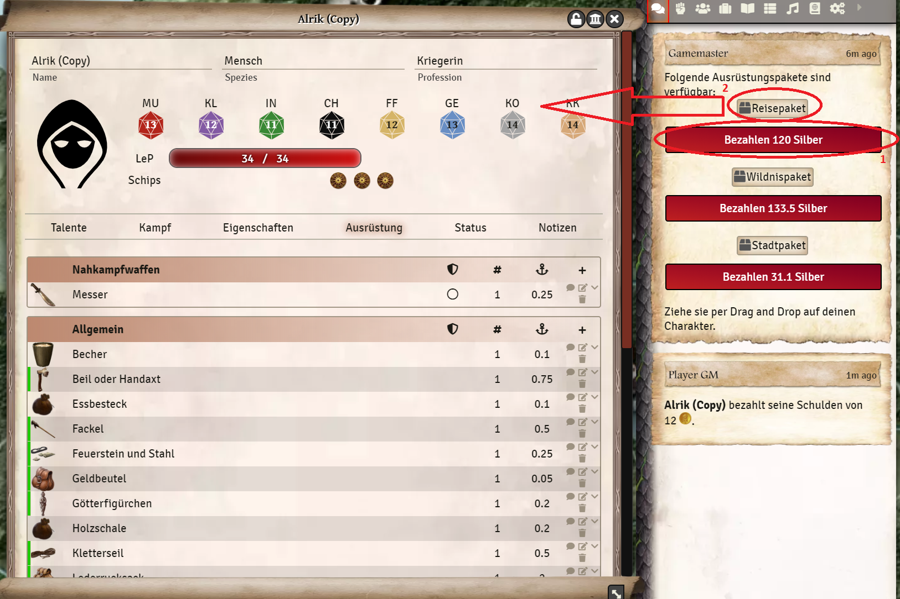
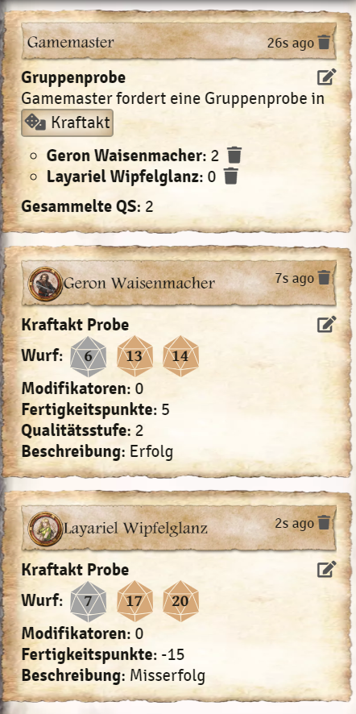

# Chat commands
There are a few DSA specific chat commands you can use in the game. These will also be explained to you when you type `/help` in the chat:  
* Pay - `/pay`  
* Get paid- `/getPaid`  
* Abilities quick-access - `/sk`, `/sp`, `/li`, `/at` and `/pa`  
* Conditions - `/conditions`  
* Tables - `/tables`  
* request check - `/rq`  
* 3w20 check - `/ch`  
* group check- `/gc`  
* equipment packages - `/packages`  
  
In this guide you will find the commands where the exact description of the command in the chat window is too extensive.

## `/ch` 3w20 check
You can trigger for NPCs the or a spontaneous check, also a 3w20 check with skill work directly in the chat.
1. type `/ch` in the chat and send the command with *Enter*.
2. a window will open where you can modify the throw.  
  
  

### Sample window 3d20 sample
The roll is performed without any further adjustments to the attributes 12/12/12 without skill points. You can modify the check, attributes, skill points and QS in the sample window. As with the check from the character sheet, the check can also be modified via the difficulty. Lastly, the type of roll can be influenced.  
**Note:** Don't be confused by the MU/KL/IN above the check, this is just set and has no influence on the check. 
  
#### Example:
I roll a check lightened by 1 (1), on attributes 14/10/14 (2) with 4 skill points (3):  
  

## `/gc` Group rehearsal
In the group check, each player can take a check. The QS of all participants is then summed to a total QS.
1. in the chat enter the command `/gc` and put a space. 
2. a list of all skills you can use will appear. Choose one of them or type it directly and send the command with enter.  
  
  
  
3. a message will appear in the chat where every player who wants to take part in the check can click on the skill check and take part in the group check.  
  
  
  
## `/packages` Equipment Packages
This command allows players to purchase one of the three equipment packages from the basic rulebook for their character. This only works as a player. As the game master, you must also then register separately as a player (**Tip:** You can also simply create your own player for this purpose).
1. type the command `/packages` into the chat and send it with enter.
2. in the list you pay by clicking on *pay X silver*, which will deduct the money from the character.
3. then you drag the above package into the character sheet.
  
  

*Translation information*  
*[x] updated: 2021-06-05*  
*[x] german entry [linked](de/de-chatbefehle.md)*  
*[x] automatic translation*  
*[ ] proof read*  
*[ ] change pictures with EN version*
*[ ] change links*  
