There is also a video to go with this tutorial: [Installing The Dark Eye in Foundry VTT](https://www.youtube.com/watch?v=bzgb_pmw-bs) (german only)

## What is what
When you start up Foundry for the first time, you see the main GUI. Before we can start a TDE game, we have to install the needed parts  

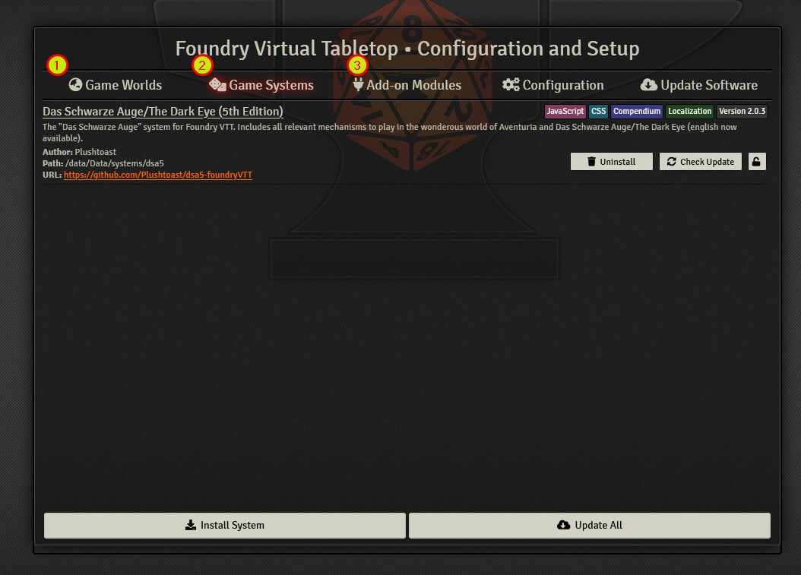  

**1. Game Worlds**  
   This is where you can create one (or many) worlds, based on a game system. Every world has ONE designated game system. A game system can have many worlds based on it. The world contains your scenes, characters, journal entries etc.
   It also contains a setup: selected options, player logins and password settings.  
   
**2. Game Systems**  
   Here, you can install and update game systems. They contain basic rules, character sheet templates etc.
   It's quite technical, what you have to know: you NEED at least one game system, in our case that's DSA/TDE.  
   
**3. Add-on Modules**  
   There are hundreds of modules available. They can contain functionalities, token, scenes, sounds etc.  
   - Learn to use Foundry without modules first
   - Test for compatibility before you use a module at all (in a separate test world)
   - Additional content may be available as "Premium" modules for money. That's the case for TDE modules like Magic. After you purchase them, you have to enter the license information on the Foundry website. Afterwards, you can download it in here.  

## Preparation: Install game system and modules  
### Game System  
Before creating a new world for DSA5, the game system must be installed.  
  
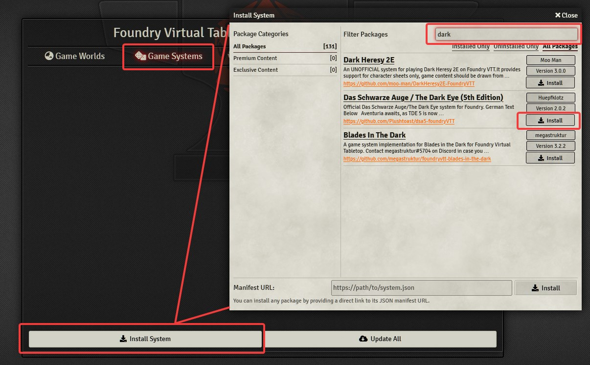  
1. first *game systems* -> *install system*  
2. enter DSA or "dark eye" in the search field
3. click the install button next to the game system's entry.  

### Modules
**"The Dark Eye - Introduction Adventure"** is a free module for TDE. It comes with scenes, a story and pre-made characters. It can help you getting into the system, or to try out TDE as a system at all.  
If you purchased other modules, you can install them instead, or you can install them all together. The installation process is always the same.  

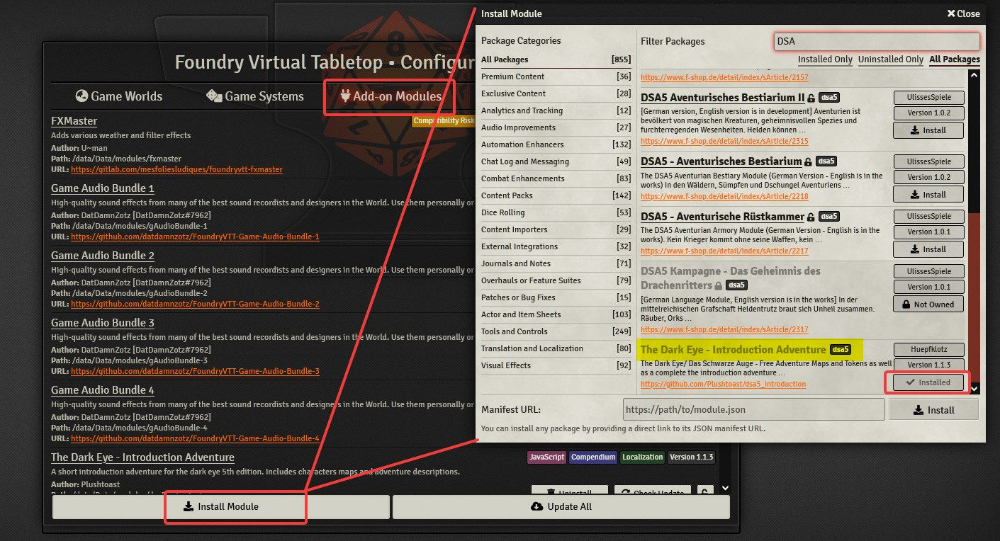  
1. *Add-on Modules* -> *Install Module*.
2. Enter text in the field *search packages* to find what you are looking for  
    - Purchased modules can be found in the "Premium Content" category
    - In general, you can search for "DSA" or "dark eye".  
3. These modules are good for a start
    - The Dark Eye - Introduction Adventure (free / perfect  to check out everything)
    - The Dark Eye 5th Ed. - Core Rules (purchase / all the base rules and entries from the base rule book)
      - additional modules can be bought from Ulisses, depending on what you want to do (Magic, Gods, Creatures etc.)
      - alternatively, you can create additional entries by hand. It takes time, but could suffice if you only need a few things.
    - FXMaster (free / allows for some effects used in the introduction adventure)  
    - Game Audio Bundle 1 - 4 (free / allows for some effects used in the introduction adventure)   
    - Tokenizer (free / allows to create nice token for TDE characters directly in Foundry)  

## Create the world
With the game system and possible modules installed, it's time to set up our playground, the place where players connect and play together. In Foundry, that's called a world, so let's create one.  

*Game Worlds* -> *Create World* will open a new window  
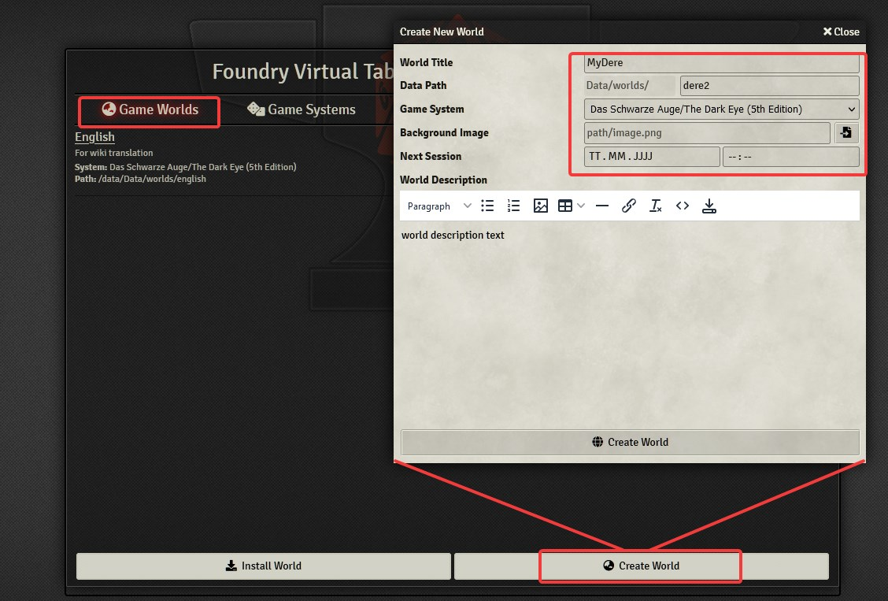  

1. **World Title** - The Name of your World. Will be shown in your list of worlds, used to identify by humans. Our World is named after the groups name, but you could go for "Dere", "Live Server", "virtual table" etc.  
To test out modules, I have another world named "TEST ONLY".  
**Can be changed after creation**  
2. **Data Path** - will be the name of the folder on the harddrive where Foundry stores all world-related infos. Use this-kind-of-format to name things, no spaces, no capital letters, no special characters.  
**Can NOT be changed after creation**
3. **Game System** - choose The Dark Eye 5 which we downloaded for this  
**Can NOT be changed after creation**
4. **Background image** - choose whatever you like. Will be the background for the login-page of this world.  
**Can be changed after creation**
5. **Next Session** - if you already know this, you can set the date and time for the next session. Can be seen on the login-page of this world.  
**Can be changed after creation**
6. **World description** - Use the editor to write some flavour text, summarize the adventure, you can write whatever you want and use links, embedd images (from URLs only) etc. Be aware, you can see this on the login-page of your world, but the window is rather small, so don't go overboard with big pictures and dozens of lines of text. Save that effort for in-world :).  
**Warning:** When you hit the SAVE button in that text editor, it instantly creates the server (Foundry 0.8.6). This may be a bug, but do this as a last step in the process.  
**Can be changed after creation**
7. **Create World** - click the magic button and feel the power of creation running trough your fingertips!  
In reality, it's quite underwhelming, but if everything went well, you should see your world in the list now.  

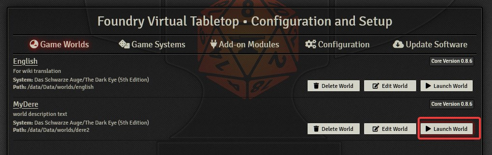  
Click "Launch World", and...

... voilà, welcome to the login screen.  
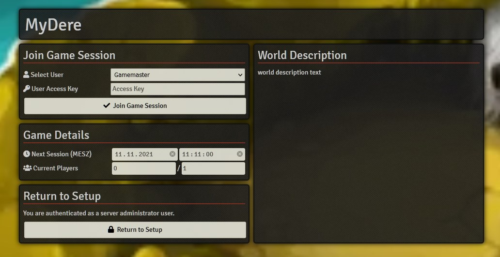  

Login as GM (default password is empty). 
The very first thing you should do within Foundry is go and set a GM password.

## Initialize the introduction adventure 
When you start the world for the first time, you will get a prompt about languages. Please note, the different items are NOT compatible between languages. You can switch the language in the settings menu, but as soon as you create or import any char/item/journal entry/rule, you have to stick with it.  
Basically, the TDE System runs in the language you set and expects all the items, abilities etc. to be in that language. Setting it to english and handing it the item STURMANGRIFF, it has no idea what it should do with that.

**IMPORTANT**: The language setting can be set by every player.   
**Make sure your players set the same language as the server runs on!** Otherwise, strange things will happen.  

### Select the language you want
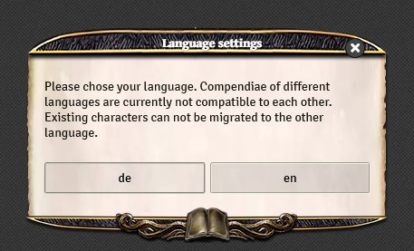  

### Activate the modules you want  
Open the settings tab -> *Manage Modules*  
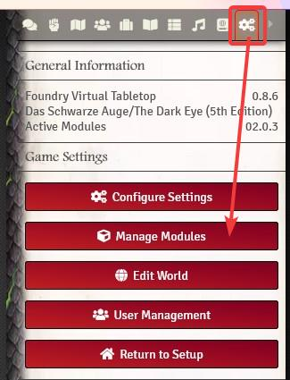

Then, activate the modules you want. In our case, that's the "Introduction Adventure".  
To see and hear effects in this adventure (weather, waterstreams etc), you can additionally activate "FXMaster" and "Game Audio Bundle 1 - 4".
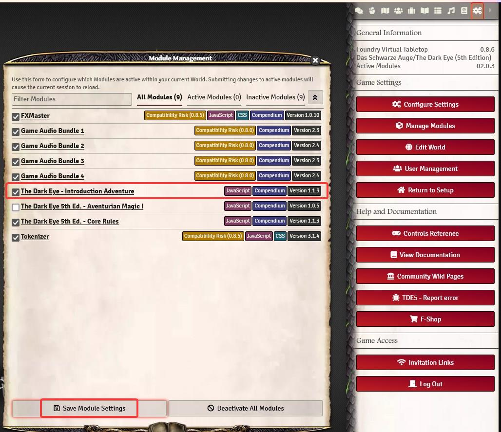

### Initialize the adventure module  

Foundry will reload, then it's time to initialize the adventure. With regular modules, you don't have to initialize anything, but adventures contain many linked entities, journal entries and so on, making this necessary.  
Journals tab -> *Journal Browser*  
Click on *Introduction Adventure*  
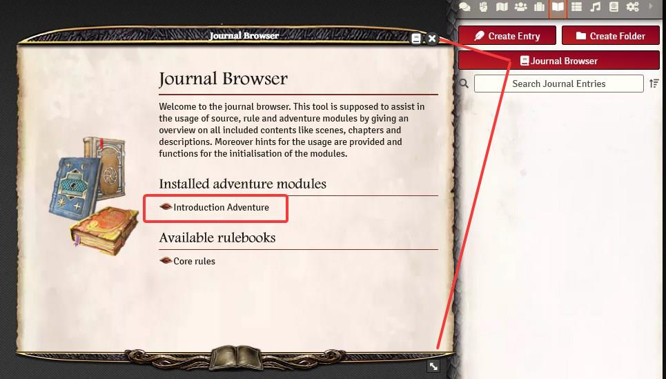  

You will see an index on the left side and information on the right. Choose *Readme -> Preparation* and scroll down.  
Click *Import*, in the next window click *Initialization*  
**And yes, you should really read all that stuff**  
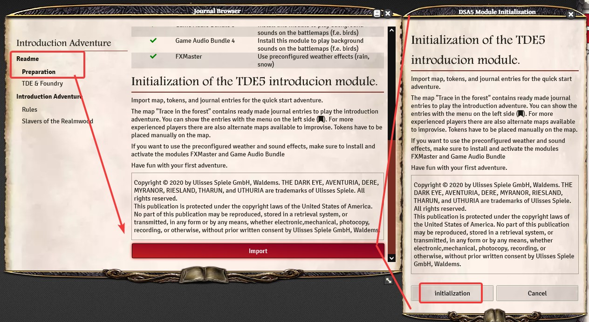

*Translation information*  
*[x] updated: 2021-06-07*  
*[x] german entry [linked](de/de-DSA_5_Welt_erstellen.md)*  
*[x] automatic translation*  
*[x] proof read*  
*[x] change pictures with EN version*
*[x] change links*  
