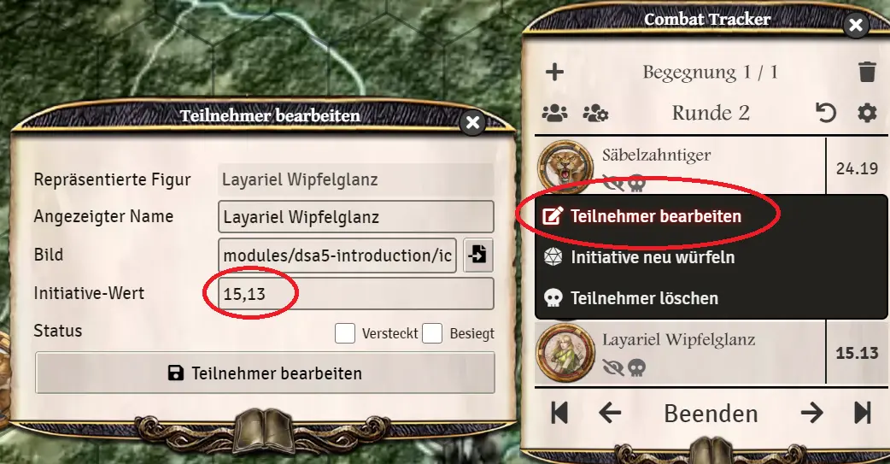
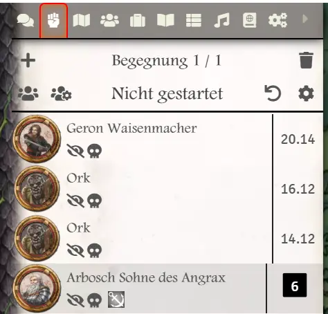
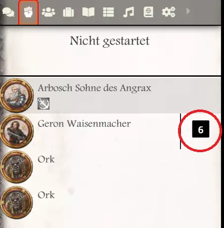
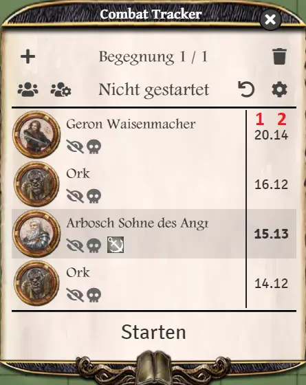

#Encounter and initiative

## To initiate a combat an encounter must be created. 
Select the desired token(s). 2.
Right click on a token and click on the *Toggle Combat State* icon in the context menu.  

  

3. in the encounter menu all previously marked tokens are listed now.
4. for all other combat participants (no matter when they enter the combat) you can proceed as explained in step 2.  

   
    
**TIP**: With a right click on the fist (encounters) the initiative list can be extracted. This way you can open the chat in the menu to keep an eye on the rolls and chat messages. 
Plus, there is a module named *combat focus* which allows you to have the chat visible below the combat tracker.

## Roll initiative

Every owner of the single token can roll the initiative himself by clicking on the w6 in the encounter list.  
  
As a game master, there are buttons for this: *Dice the initiative for all* and *Dice the initiative for NPC's*. For the latter, the initiatives are automatically rolled for creatures and NPCs.  

  
  
As a player you can roll the initiative of the characters you can control.  

  

When the initiative is rolled, 2 values appear separated by a dot. The first value is the INI rolled (1). The second value is the INI base value (2). This is used to let the player with the higher base value act first if the INI rolled is the same.  
  

## Edit initiative
You can also edit the initiative as GM (e.g.: Delay Action or Axxelleratus). To do this, right-click on the character in question and select *Edit Character*. The first value before the comma is the rolled INI and the second is the base value.
  
  

*Translation information*  
*[x] updated: 2021-06-07*  
*[x] german entry [linked](de/de-begegnung_und_initiative.md)*  
*[x] automatic translation*  
*[ ] proof read*  
*[ ] change pictures with EN version*
*[ ] change links*  

