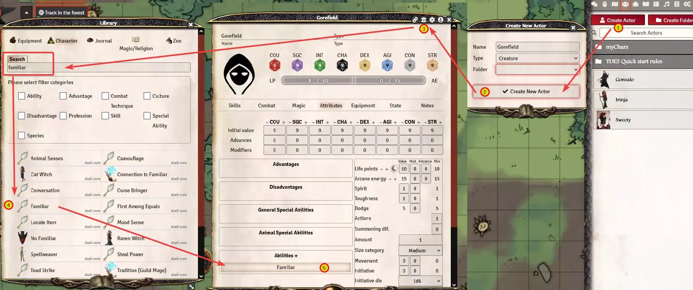

## Creation of a familiar

When you play a witch\*er, you may need a familiar. You can transform any crature into a familiar and give it the corresponding bonuses.
Either use an existing entry from the library (must be a "creature" type), or create a new one from scratch.

**IMPORTANT:** When you create your own, make sure to add "Natural Armor" to it, even if the value is zero. The "Familiar" ability needs this entry to work properly. *You can copy this entry from the "cat (barn cat)", so you don't have to create it by yourself.*

Add the ability "Familiar" to the character sheet (use the library to search for it). The creature gets the bonuses according to the rules, and you can add adventure points to it.  
  

**Notes**:  

+ In order for the player to control this familiar, the GM has to set the permissions accordingly for that character. Otherwise, only the GM can control the familiar.
+ To create a regular animal companion (without the bonuses), you can add the "Familiar" ability. Then, you have to create a new ability which deducts the bonuses from "Familiar" again. This will leave you with a creature with AP, but no special bonuses.   

*Translation information*  
*[x] updated: 2021-07-08*  
*[x] german entry [linked](de/de-Vertrautentiere)*  
*[x] automatic translation*  
*[x] proof read*  
*[x] change pictures with EN version*
*[x] change links*  

