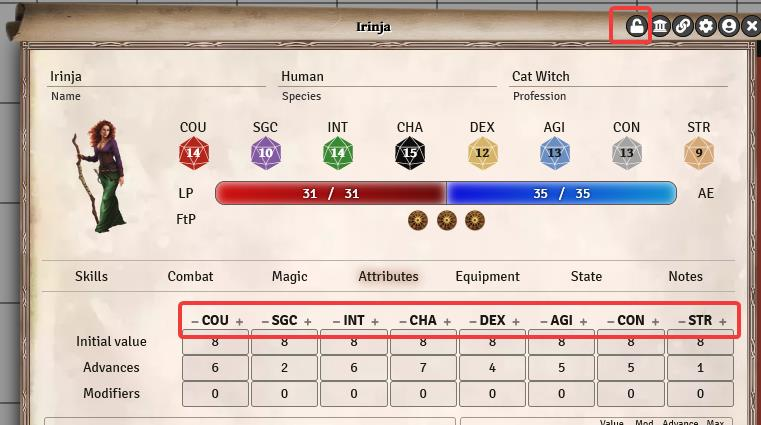

## Why is ... not working?  

1. Have you installed any (non TDE) modules? If so, please de-activate them and try again. Module incompabilities can happen.
2. Foundry doesn't update itself. So try to update.  
	* **make a backup first**  
	* Update the game system  
	* Update the modules  
	* Check if there is a update for the Foundry Software itself. Before you update, check if the TDE modules are marked as compatible for that version beforehand. 
3. If the problem persists, you can get help in the [Discord Channel](https://discord.com/channels/170995199584108546/807029112215830588) or submit an [issue on github](https://github.com/Plushtoast/dsa5-foundryVTT/issues)

## How can I activate my purchased Foundry products at Foundry?
Open the page of [Foundry VTT](https://foundryvtt.com/) and log in with your Foundry account. Click on your name in the upper right corner of the page and then click on 
*Premium Content*. Here you enter your key, which you got from Ulisses (By mail and in the F-Shop under: *My Account* -> *Orders* -> click on *Show* when ordering). After that the module is available in Foundry under *Modules* (Category "Premium Content").

## How do I create a wizard/blessed one?
Basically you have to assign the advantage *Blessed* or *Spellcaster* to your character. But this is not enough to see the magic or religion tab in the character sheet. You have to add one of the following items to the character: magic/karmic special skill, spelsl, cantrip, ritual, liturgy, ceremony, blessing.
For more details, see the [Character Creation](en-character-creation) and the [character sheet](en-charactersheet).

## Where can I ask questions or get support for problems?
See above, point 3 under "Why is ... not working?"

## I can't find my weapons under combat in the character sheet.
Make sure you have the weapons equipped in the equipment tab. You can do that by placing a check mark in the *Shield* column. For details, check out the guide: [Character Sheet - Equipment](en-charactersheet#5-equipment).  

## How can I create tokens that look like from the DSA books?
With the module "Tokenizer". You can find a short how-to in [this section.](en-character-creation#11-portrait-and-token)

## Why does the attribute adjustment of the species not change the values in the character sheet attributes tab?
According to the DSA rules, the attribute adjustment does not mean that this value is adjusted directly. It only adjusts the maximum value allowed during character creation.
For example, if the character gets COU+1 from the species, he may directly improve this value to 15 instead of 14. For CHA-2, the maximum during creation is 12.  
(Values in this example are based on a character with experience level *experienced* / 1100 AP)

## Changes of the skill values directly in the field are not counted towards the adventure points!
The input fields should give the player/game master full control over their values to be able to implement house rules if necessary. This also allows you to work around possible mistakes in character creation in the short term.  
**To calculate the AP, you must always use the +/- buttons.** You can lock / unlock the charsheet, this will hide / show these buttons (for spells, talents, attributes etc.)  

*Translation information*  
*[x] updated: 2021-06-10*  
*[x] german entry [linked](de/de-FAQ.md)*  
*[x] automatic translation*  
*[x] proof read*  
*[x] change pictures with EN version*
*[x] change links*