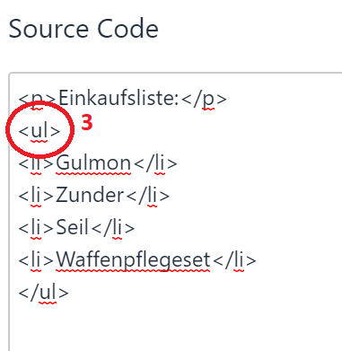

# Journal - List with TDE Icons (Eye)

To use the TDE eyes in a journal entry for a list, you have to edit the HTML code a little bit.
1. first write the list with the normal list function of the journal editor.
2. then open the HTML code with the <> symbol

3. there is the entry `<ul>`. This must be changed to `<ul class="dsalist">`

4. then after saving the entry the dots will be replaced by the typical TDE eyes. (In edit mode they still look like normal dots!).

*Translation information*  
*[x] updated: 2021-06-07*  
*[x] german entry [linked](de/de-Journal-DSA_Icons_Auge.md)*  
*[x] automatic translation*  
*[ ] proof read*  
*[ ] change pictures with EN version*
*[ ] change links*  

