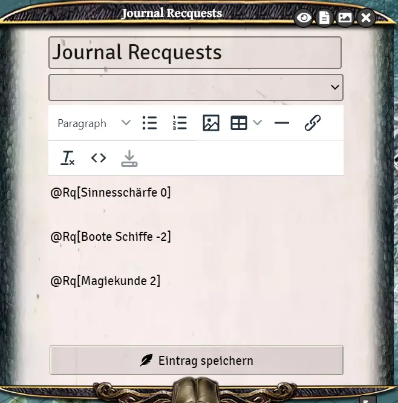
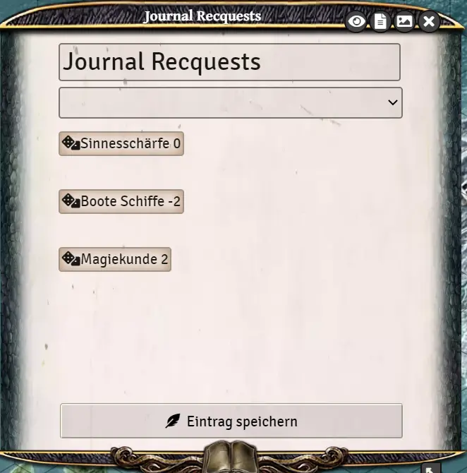
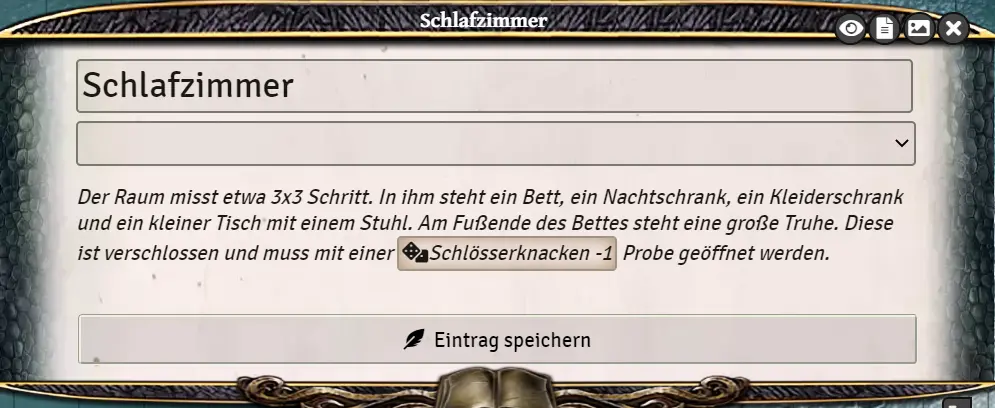

# Journal - Request a check in the chat with a single click

As a game master there is the possibility in the chatfenser over the command /rq TALENTNAME to create a message in which a button can be clicked to execute the desired check directly. 

This can also be used in journal entries.  
Command to be embedded in the text: @Rq[TALENT MODIFICATOR]  
The modifier must always be included. If the check is not modified, a 0 must be entered (e.g.: @Rq[Sense -1]). A positive modifier is always written without the sign (Ex: @Rq[Body Control 2]
Also, special characters like & do not work in the command and are simply omitted from the skills (Ex: @Rq[Convert 0]).

|||
### Example game master preparation:
This is useful for directly placing, for example, this journal entry directly on the map in a room.
For example, there may be a locked chest there that requires a lock picking check.

Journal entry: *The room measures about 3x3 steps. In it are a bed, a bedside cabinet, a closet, and a small table with a chair. 
At the foot of the bed is a large chest.
This is locked and must be opened with a @Rq[lock picking -1] check.

If the game master clicks on the button, a chat entry appears which the players use directly to place the roll.

*Translation information*  
*[x] updated: 2021-06-07*  
*[x] german entry [linked](de/de-Journal-Probe_anfordern.md)*  
*[x] automatic translation*  
*[ ] proof read*  
*[ ] change pictures with EN version*
*[ ] change links*  

