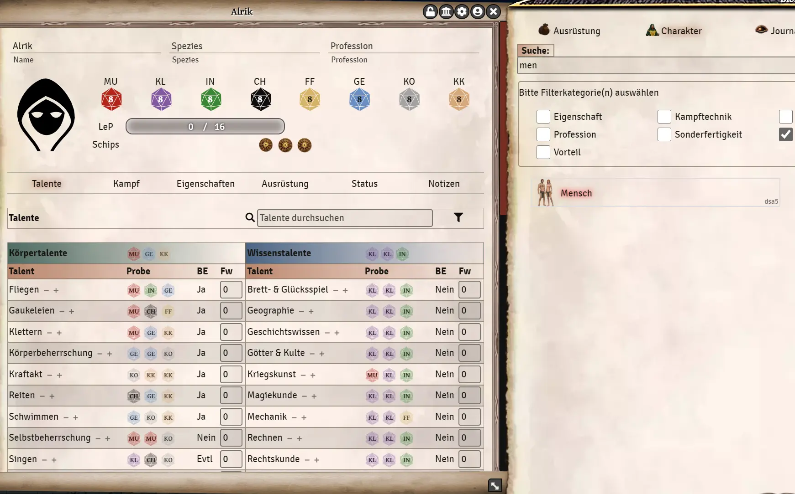
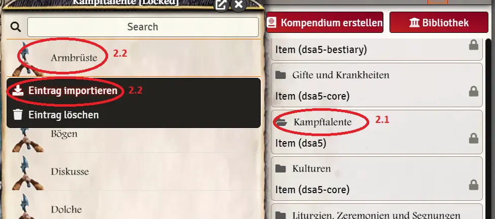
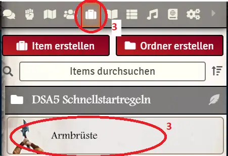

# Library (Compendium Packages)
The Compendium Packages can be found via the menu (1) and contain everything your DSA modules provide you with. The contents are organized by categories:
* Actor, Item, Scene, JournalEntry, Macro, RollTable, Playlist   
 
  
  

## Compendium and Library
At the top of the bar there are 2 buttons:
1. **Compendium**: This allows you to browse compendiums, or to create them so you can store your own content. (See Create your own content).
2. **Library**: All DSA compendiums can be searched here simultaneously, as the library combines all the entries in one place. You have category tabs (3), a search field (4) and checklists (5) so that finding the content is easy and fast. Building up the search index can take several seconds, depending on the number of installed modules.
  

3. **From character sheet** You can access the library directly from every character sheet. Just click the small "library" icon in the top right corner.  

## Compendiums
1. the entries are so called compendiums to a certain topic (ex. compendium: equipment). 
2. in brackets below the compendium is written from which module the compendium comes from.
3. a lock behind it means that it is write-protected. This write-protection can be deactivated, but individual changes would be overwritten every time the module is updated.  
  

## Use contents
Everything from the compendium can then be used directly in the game via the following ways: 
1. drag and drop: much can be dragged and dropped directly into the game. 
  1.1: Ex: Drag species to new actor:  
    
  
  
3. import: Import actively adds the entries to your world:
  2.1. open compendium by clicking on the name
  2.2. right click on the entry and then *Import entry!*  
    
    

3. you will find it in under the respective menu item. This is useful to Create own content
  

*Translation information*  
*[x] updated: 2021-06-05*  
*[x] german entry [linked](de/de-bibliothek.md)*  
*[x] automatic translation*  
*[ ] proof read*  
*[ ] change pictures with EN version*  
