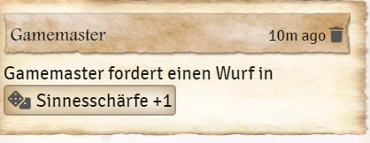
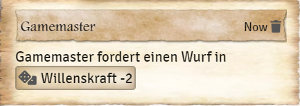
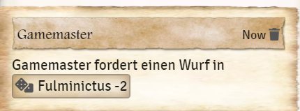

# Macro - Request a check
You can also write macros to quickly request a check from players in the chat window.  
  
1. create a new macro and set it to *script*.  
2. then write the code `game.dsa5.macro.requestRoll("TALENT", MODIFICATOR);` in the *Command* field (examples see below)  
  
  
  
## Examples
### Sense with penalty of 1
`game.dsa5.macro.requestRoll("Sense Acuity", -1);`  
  

  
### Convert & Convince with a bonus of 1
`game.dsa5.macro.requestRoll("Convert & Convince", 1);` !  
  

  
### Willpower with a penalty of 2
`game.dsa5.macro.requestRoll("Willpower", -2);`  
  

  
### Spell Fulminictus with a penalty of 2
`game.dsa5.macro.requestRoll("Fulminictus", -2);` !  
  

*Translation information*  
*[x] updated: 2021-06-07*  
*[x] german entry [linked](de/de-Makro-Probe-anfordern.md)*  
*[x] automatic translation*  
*[ ] proof read*  
*[ ] change pictures with EN version*
*[ ] change links*  

