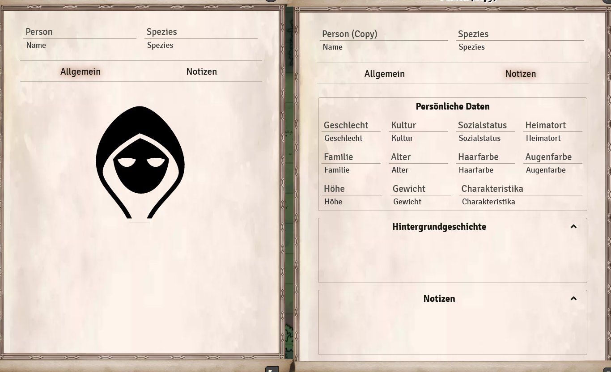
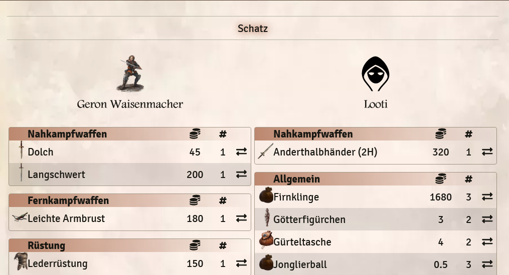

# Merchant, person and treasure character sheet
There is a new character sheet. with this you can depict merchants, treasures and simple persons.  
**Note**: Buying and exchanging items between player and merchant/treasure is only possible if a game master is logged into the game! Otherwise nothing happens when clicking buy/sell/take!   
  
To use the character sheet you have to do the following:
1. create a new player -> *non-player character*.
2. change the character sheet via the gear *Configure Sheet* to *MerchantSheetDSA5*. **Attention** please don't change the sheet at standard sheet!
3. on the merchant tab of the character you can choose between *normal person*, *merchant* or *treasure*.

  
  

## Settings by the game master:
* In order for players to have access to the actor they must have the *Restricted* right to the merchant.
* They can then access the merchant via the token on the screen or in the actor menu.
* Note that the token on the scene does not change the actor in the menu. So you can reuse the merchant/loot if they only access it through the scene.
* Interaction with the merchant are only allowed when a game master is logged into the game.

The game master can use the *Toggle Limited View (Player View)* button in the upper right corner of the character sheet to get the players view of the merchant.  
  

## Merchant
1. you can set the multiplier for the buying and selling factor of the merchant (ex: 2 for double, 0.5 for half)
2. to trade, the merchant needs money. Otherwise the players can't sell anything to him. 
3. you can simply add the equipment from the library to the trader or use the + to add and change a dummy (3.1). There is also a Random selection button to fill the dealer randomly (3.2).  
  
 

### Merchant menu (player view)
Players can either access the trader via the Actor menu or directly in the scene via the token. A trading window will then open:  
1. **Sell**: Sells the item to the merchant for the price of the item's value offset by the buy factor.
2. **Buy**: Buys the item with the number 1 at the specified price.
  
  

## Treasure
* Players have complete access to everything assigned in the treasure, including the money.
* Again, a random selection of items can be created. Or, as with the merchant, you can manually drag everything into the character.

  
  
### Treasure menu (player view)
Players can either access the treasure via the Actor menu or directly in the scene via the token. A swap window then opens:
* Here, items can be taken from the treasure's inventory (1) or items can be placed in it (2), as desired.

## Person
A Normal Person has all the character values of an NPC from the player's point of view. However, this sheet can also be opened by the players and then shows very little of the NPC. This can be useful to provide at least some info to the players.

### Person menu (player view)
The players can either access the person via the Actor menu or directly in the scene via the token. An info view will then open:
* Only information about name, species, the character picture and the notes page (Without GM information) are available.
  

**Note**: Give us feedback on how we can improve this feature in the future.

*Translation information*  
*[x] updated: 2021-06-07*  
*[x] german entry [linked](de/de-haendler.md)*  
*[x] automatic translation*  
*[ ] proof read*  
*[ ] change pictures with EN version*
*[ ] change links*  

