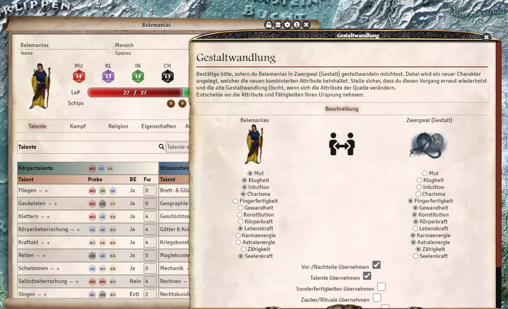
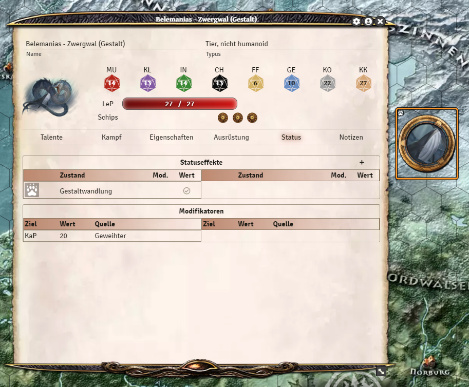

# Shapeshifting
**Note** Shapeshifting is only available in the modules Aventurian Gods and Aventurian Magic!

Shapeshifting requires the right to create tokens and actors. In the default settings only the game master is allowed to. So currently the game master should start and stop shapeshifting.  
We will change this feature further when we are sure that it works stable.

To shapeshift, simply draw a creature on the character sheet and follow the instructions that appear. For players, a new creature with adjusted stats will then be created in the Actor menu. Also, the token in the scene is replaced with the new creature.
A shapeshift for NPCs and creatures replaces them completely without creating a new Actor!

To undo the shapeshift, open the character sheet of the creature and right click on the *shapeshift* status in the status tab to delete it. The temporary actor will be deleted and transformed back to the original one.

You can also use the *Token Magic FX* module to display an animation during the shapeshift.

*Translation information*  
*[x] updated: 2021-06-07*  
*[x] german entry [linked](de/de-Gestaltwandlung.md)*  
*[x] automatic translation*  
*[ ] proof read*  
*[ ] change pictures with EN version*
*[ ] change links*  

