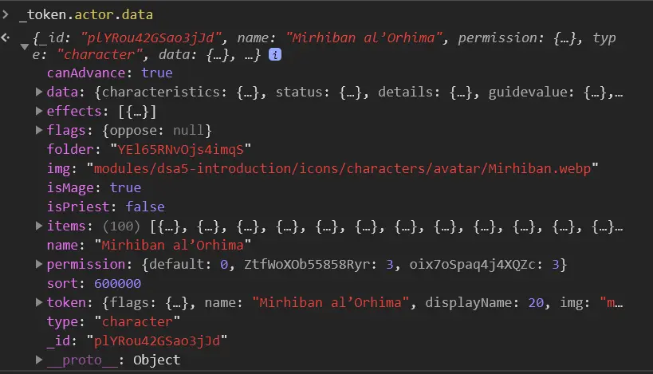
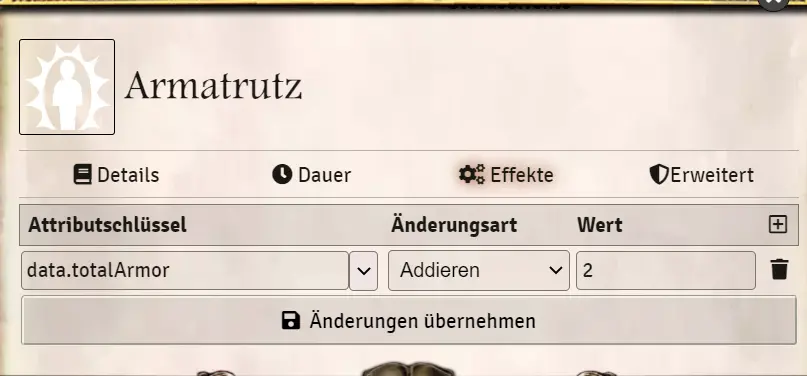

# Status - Self-created effects
Effects offer the possibility to influence certain character values. Self-created effects are available in various objects within Foundry: Characters, Spells, Rituals, Liturgies, Ceremonies, Equipment, etc. Anywhere you have an effect/damage effects tab in the object's window. From the basic principle, they all work similarly, so here are 3 examples:
* [Effects from Actors](en-status-self-created-effects#actor-effects)
* [Effects from a melee weapon (Item](en-status-self-created-effects#effect-of-a-melee-weapon-item)  
* [Talent adjustments by effects](en-status-self-created-effects#talent-adjustments-by-effects)

Also, here is the description of how to have the duration of effects handled automatically:
* [Effect Duration](en-status-self-created-effects#effect-duration)

## Actor effects
**You can change all data values of actors.** Note that some of them are calculated and therefore always overwritten. Therefore, this function should be used with caution!  
But there is a selection of values in the effect mask. These can be used without problems.
To use effects you have created yourself, open the character sheet and go to the Status category. Use the + to create a new effect, name the status effect and enter the desired changes.

### Selection list of the most important effects
You can choose between the most important attributes and attributes from a selection list:
1. create a new effect
2. open it for editing
3. in the Effects tab, create a new one by clicking the + in the frame
4. here you have under attribute key now a selection of common effects
  
  

### Example
#### Armatrutz
Create a new status in the character sheet under Status and add a new attribute called "data.totalArmor". Set the mode to *"Add "* and enter the desired armor value as value (ex: 1)
This way you can create different Armatrutz effects with different armor values, so that the player only has to activate the appropriate one when he casts the spell successfully. The changed armor value will then be displayed under combat in the character sheet.
  

  
## Effect of a melee weapon (Item)
You can add status effects to Items to create magic artifacts, for example. This only works for items that are wearable or consumable!
**Caution: The item effects cannot be adjusted in-character. For this you have to change the item under Items and drag it back into the character sheet. 1.

1. create the desired item and then go to the status effects tab
2. click on the + in the frame and create the effect
3. equip the item and the entered effect will be applied directly. 
3.1 You will find this effect in your character sheet under *Status* -> *Transferred Status Effects*.
  

  

## Talent adjustments by effects
To use *Talent - XY* in effects, you must do the following. 
1. select attribute key
2. change type to *Own*.
3. under value enter TALENT VALUE. You can enter more than one value, they will be separated by *,* and written one after the other without spaces. Ex: 
    * Sensory acuity 1
    * Climbing 2,Body control 1
    * Wilderness life 2,Orientation 1,Tracking 2

### Example: Dice cup of luck
A dice cup that gives 2 skill points to board & luck play:  
  

  
## Effect duration
If you want the duration of the effects to run automatically, you need the following modules:
* [about-time](https://gitlab.com/tposney/about-time)
* [times-up](https://gitlab.com/tposney/times-up)  

Further settings in the modules are not necessary, because the basic settings of About-Time already fit quite well with 6 seconds per KR.  
  
To add the duration in an effect you have to do the following:
1. open the configuration window of the effect with the edit button
2. in the effect-window go to the tab *Duration*.
3. you have the choice between different options. Most commonly used are *Duration (seconds)* and *Duration (moves) - rounds*.
   Once the time/round is up, the effect will automatically disappear from the character sheet.
   
  
   
## Advanced Tip:
If you know a bit about the Console (F12 in the browser) you can search the game data for the values yourself.  
Mark a token and type into the console: *_token.actor.data*. Then you can see the values that can be influenced by this. More infos will follow.
  

*Translation information*  
*[x] updated: 2021-06-07*  
*[x] german entry [linked](de/de-status-selbst-erstellte-effekte.md)*  
*[x] automatic translation*  
*[ ] proof read*  
*[ ] change pictures with EN version*
*[ ] change links*  

